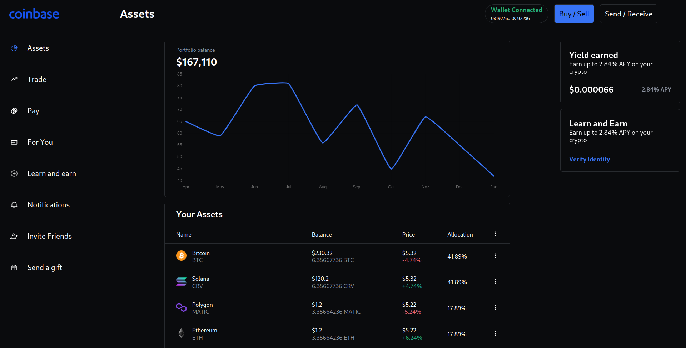

## Coinbase Blockchain App

This is a [Next.js](https://nextjs.org/) project bootstrapped with [`create-next-app`](https://github.com/vercel/next.js/tree/canary/packages/create-next-app).

- Web 3.0 Application with Next JS
- Used Styled Components for styling
- Created and minted Cryptocurrency Tokens using the thirdweb SDK
- Added Web 3.0 authentication using Metamask
- Stored data and information about the tokens in Sanity.io
- Used GROQ to retrieve data from Sanity Studio and display it the Web 3.0 App
- Created a send and receive functionality for the tokens on the blockchain

